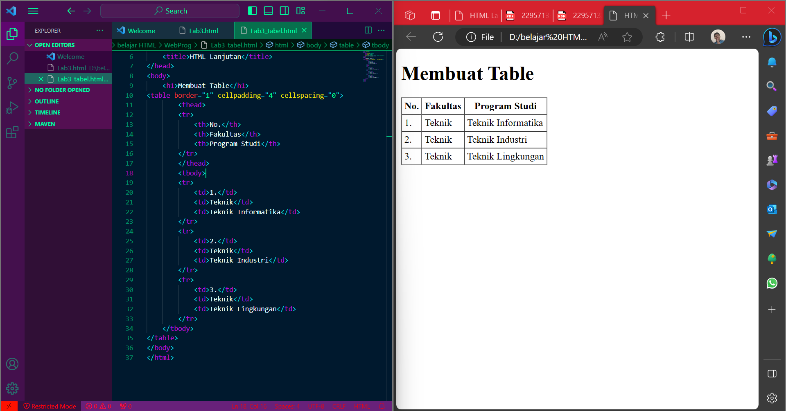

# Web3_Html 
|**Nama**|**NIM**|**Kelas**|**Matkul**|
|----|---|-----|------|
|Muhammad Fiqri Setyoadi|312210062|TI.22.A.2|Pemograman Web|

## Membuat Ordered List

## Membuat Unordered List

## Membuat Description List

## Membuat Tabel dan Mengatur Margin dan Padding

## Menggabungkan Sel Data

## Membuar Form

## Menambahkan Style pada Form

## Pertanyaan dan Tugas
1. Buatlah form yang menampilkan dropdown menu dan listbox dengan multiple selection.

## Jawaban 
untuk melihat file  [HTML](Listbox.html)

untuk melihat file  [CSS](Listbox.css)

## Sekian dan Terimakasih Mohon Maaf atas Kekurangannya 🙏🎓
